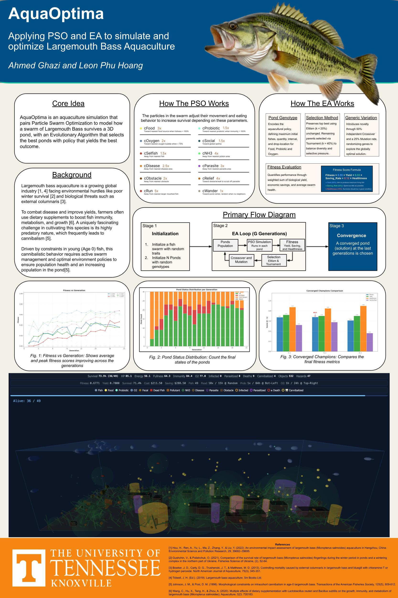

# AquaOptima: Optimize Aquaculture using Swar

**Authors:** Leon Phu Hoang and Ahmed Ghazi


## 📖 Overview

Largemouth bass aquaculture is a rapidly growing global industry. However, it faces significant environmental hurdles, such as poor winter survival, and biological threats like external columnaris. To combat disease and improve overall yields, farmers often utilize dietary supplements to boost the fish's immunity, metabolism, and growth.

A uniquely fascinating challenge in cultivating Largemouth Bass is their highly predatory nature, which frequently leads to intracohort cannibalism, especially constrained to young (Age-0) fish. This aggressive cannibalistic behavior requires active swarm management and optimal environmental policies to ensure population health and an increasing pond population.

**AquaOptima** solves this by optimizing the environment for Largemouth Bass Aquaculture. The project simulates the lifetime of a swarm in many near-realistic 2D ponds. The simulation pairs a **Particle Swarm Optimization (PSO)** model to simulate how the swarm survives in a 3D pond, with an **Evolutionary Algorithm (EA)** that selects the best ponds yielding the highest survival rate, best health conditions, and cheapest policies.



## 📊 Fitness Evaluation

The simulation quantifies the performance of each pond through a weighted sum of biological yield, economic savings, and average swarm health.

| **Metric**      | **Weight** | **Description**                                      |
| --------------- | ---------- | ---------------------------------------------------- |
| **Yield**       | 55%        | Aim to produce the maximum number of living fish.    |
| **Saving_Rate** | 33%        | Spend as little budget as possible on the policies.  |
| **Healthiness** | 12%        | Surviving swarm members should be in good condition. |

The final fitness score is calculated using the following formula:

$$
Fitness = 0.55 \times Yield + 0.33 \times Saving\_Rate + 0.12 \times Healthiness


$$

## 🚀 Running the Simulation

### Running the Demo

To run the included demo simulation with the 3D visualizer:

1. Copy and rename the demo log file:
   **Bash**

   ```
   cp ./logs/simulation_data_demo.json ./logs/simulation_data.json
   ```

2. Start a local Python HTTP server:
   **Bash**

   ```
   python -m http.server 8000
   ```

3. Open your browser and navigate to:
   `http://localhost:8000/visuals/index.html`

### Compiling Your Own Simulation

To compile and run your own custom simulation with different genetic or swarm parameters:

1. Edit the constants in `./core/constants.py`.
2. Run the core execution script:
   **Bash**

   ```
   python core/run.py
   ```
